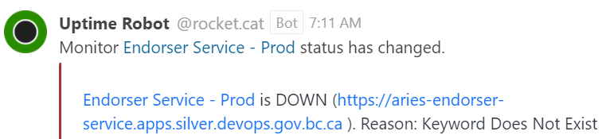

# Aries Endorser Service Uptime Alert Workflow

The following workflow describes the steps to confirm and resolve an Aries Endorser Service alert condition on one of the Endorser Service instances. Addition information regarding the associated error condition and its impact, along with details of the steps to resolve it can be found below.

  

## What does an alert look like?

## About the Aries Endorser Service

The [Aries Endorser Service](https://github.com/hyperledger/aries-endorser-service) is an Aries Agent instance complete with a proxy server and controller configured as an endorser. The purpose of an endorser is to provide governance and control over what gets written to a particular ledger by an organization's author agents. The endorser is registered on the ledger with the permissions required to sign transactions, in effect endorsing them and allowing them to be written to the leger.  Authors are registered on the ledger without any permissions, and are then registered with an endorser to have their transactions signed (endorsed) so they may be written to the ledger. This helps to ensure only registered authors can write to the ledger and provides a way to manage what they can write to the ledger.

### What is the impact of the Aries Endorser Service being down?

Any author agent configured to use the service as its endorser will be unable to write new transactions to its corresponding ledger, as the author relies on the endorser to sign (endorse) the transactions so they may be written to the ledger.  This can be a serious issue for agents that need to write revocation registry entries to the ledger to revoke credentials.

### What affects the Aries Endorser Service?

The most common situation known to affect credential verification is:

Unexpected pod evacuations or restarts
  - When this situation occurs, it can affect one or more of the components that make up the service. Typically, there are enough of the components distributed across unaffected nodes and/or the components start-up on their new compute node fast enough that the issue goes unnoticed.  However, in some cases components can get stuck in a pending or starting state on a node that is overloaded after an unexpected restart or evacuation of another node.
  - These scenarios cause true positive conditions that can require intervention in order to clear the alert in a timely fashion, however in many cases the alert condition is cleared or in the process of clearing automatically by the time you start looking into the issue, in which case you just need to monitor the process to make sure it completes in a timely fashion.

## Aries Endorser Service Instances

A list of Aries Endorser Service instances can be found here; [Aries Endorser Service Instances](./aries-endorser-sevice-instances-and-environments.md#instances)

## Aries Endorser Service OCP Environments

Links to the Topology Console can be found here; [Developer - Topology Console](./aries-endorser-sevice-instances-and-environments.md#developer---topology-console)

## Performing a rollout

Information on the various ways to perform a rollout can be found here; [Performing a Rollout](./performing-a-rollout.md)