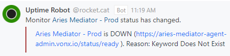

# Aries Mediator Service Uptime Alert Workflow

The following workflow describes the steps to confirm and resolve an Aries Mediator Service alert condition on one of the Mediator Service instances.  Addition information regarding the associated error condition and its impact, along with details of the steps to resolve it can be found below.

  

## What does an alert look like?

## About the Aries Mediator Service

The Aries Mediator Service is an Aries Agent instance complete with a proxy server configured as a mediator for use with mobile wallets such as the BC Wallet.  The service acts as the mediator between the mobile wallet and other Aries Agent instances that are interacting with the mobile wallet to issue or verify credentials.

### What is the impact of the Aries Mediator Service being down?

Any mobile wallet configured to use the service as its mediator ceases to function properly, as it relies on the mediator to communicate with other agents.

### What affects the Aries Mediator Service?

The most common situation known to affect credential verification is:

Unexpected pod evacuations or restarts
  - When this situation occurs, it can affect one or more of the components that make up the service.  Typically, there are enough of the components distributed across unaffected nodes and/or the components start-up on their new compute node fast enough that the issue goes unnoticed.  However, in some cases components can get stuck in a pending or starting state on a node that is overloaded after an unexpected restart or evacuation of another node.
  - These scenarios cause true positive conditions that can require intervention in order to clear the alert in a timely fashion, however in many cases the alert condition is cleared or in the process of clearing automatically by the time you start looking into the issue, in which case you just need to monitor the process to make sure it completes in a timely fashion.

## Aries Mediator Service Instances

A list of Aries Mediator Service instances can be found here; [Aries Mediator Service Instances](./aries-mediator-sevice-instances-and-environments.md#instances)

## Aries Mediator Service OCP Environments

Links to the Topology Console can be found here; [Developer - Topology Console](./aries-mediator-sevice-instances-and-environments.md#developer---topology-console)

## Performing a rollout

Information on the various ways to perform a rollout can be found here; [Performing a Rollout](./performing-a-rollout.md)