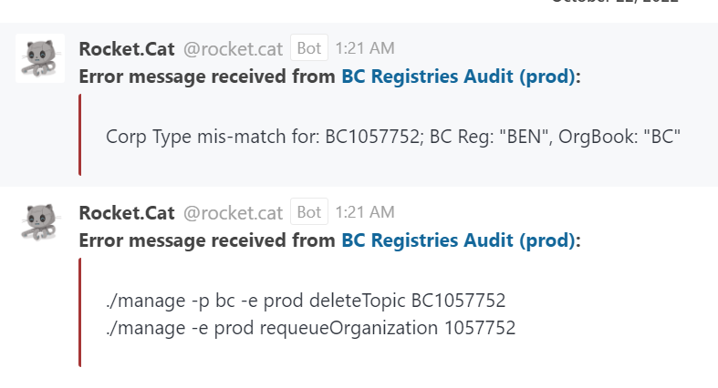

# BC Registries Audit Notification Workflow

The following workflow describes the steps to confirm and resolve a BC Registries Audit alert notification. Addition information regarding the associated error condition and its impact, along with details of the steps to resolve it can be found below.

<p align="center">
  
</p>

## What does an alert look like?




### What does it mean for the BC Reg and OrgBook data to match (pass the audit)?

There should be no discrepancy of data between BC Reg and Orgbook data inorder to pass the audit. That means corporation name, corporation status, corporation type,business number,registration number,jurisdiction number should be matching between BC Reg and Orgbook exactly to pass the audit.


### What is the impact of the data being out of sync?

When the data is out of sync the dispalyed data of companies in orgbook is incorrect.In order To synchronize their information we want to make sure that we're providing them with  the correct information.If its incorrect, we're misrepresenting the actual corporate data and that needs to be fixed.


### What affects the synchronization of the data?

Synchronization of the data is affected by updates being made in BC registries. Some of those updates are not associated with database event records. So then if there's no database event record, then the BC registries agent doesn't know to pick up those changes and then send them over to the org book. So that's that's one major discrepancy is when things are done manually on the VC registry side.There is no way for us to detect that that's actually happened until the audit is done.

Other things that affects synchronization is timing. So in case where the audit says that there's a missing record in BC in Org book, and then you go in later to take a look at that data and it's there, that's really a timing issue. So basically what happened is the audit captured the fact that data was in BC Reg but not in Org book before the data was actually sent over to the orgbook.So the timing issue is between when the audit script is run and when data is actually being synchronized.

There are bunch of services always running. So if those services are interrupted or Internet connectivity is down, that can affect the synchorization of data for a little while.

## Digital Trust Monitoring Services OCP Environments

Links to the Deployment Configurations Console can be found here; [Administrator - Deployment Configurations Console](./digital-trust-monitoring-services-environments)

## BC Registries Agent Configurations `./manage` script

General information regarding the bcgov/bc registries-agent-configurations openshift `./manage` script can be found here; [bcgov/bc-registries-agent-configurationsopenshift `./manage` script](./bc-registries-agent-configurations-manage-script.md)

Specifics regarding the commands referenced in this workflow can be found here:
- [`requeueOrganization` command](./bc-registries-agent-configurations-manage-script.md#requeueOrganization-command)
- [`queueOrganization` command](./bc-registries-agent-configurations-manage-script.md#queueOrganization-command)


## What causes the alert condition to surface?
In general we see these notifications when the BC Registries Audit scripts detect any discrepancy between the data in the BC Registries database(s) and the data in the OrgBook.

For Example: Corp Type mis-match for: BC1057752; BC Reg: "BEN", OrgBook: "BC"

### What steps needs to be taken to resolve this error?

In order to solve the alert above.

Confirm the alert by browsing to ""Orgbook.gov.bc.ca"" to verify 
the alert received in BC Registries Audit Notification is not false positive by ensuring the data of Orgbook matches with BC Registries;

Once the alert is confimed

Log into the affected OCP environment;


```
./manage -p bc -e prod deleteTopic BC1057752
./manage -e prod requeueOrganization 1057752
```

In this example, the corp type mis-match represents companies Status mis-matching in OrgBook, and must be queued from BC Reg

The first line represents the status of company in OrgBook is incorrect and must be deleted and re-processed.

The commands should be run in the order listed, however, if, for some reason, you need to run the commands in a batch, the `orgbook-configurations` scripts should always be run first.

Commands in the following forms should be run using the openshift `./manage` scripts from [orgbook-configurations](https://github.com/bcgov/orgbook-configurations):
- `./manage -p bc -e <env> deleteTopic <business_number>`

Commands in the following forms should be run using the openshift `./manage` scripts from [von-bc-registries-agent-configurations](https://github.com/bcgov/von-bc-registries-agent-configurations):
- `./manage -e <env> queueOrganization <business_number>`
- `./manage -e <env> requeueOrganization <business_number>`

## Audit scripts for Aries VCR/OrgBook and BC Registries Issuer

This repository provides scripts to audit the OrgBook search database and agent wallet against the source BC Registries data; [Audit Scripts](https://github.com/bcgov/von-bc-registries-audit/blob/main/README.md#understanding-the-output)
