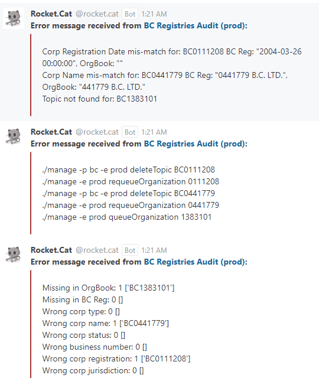
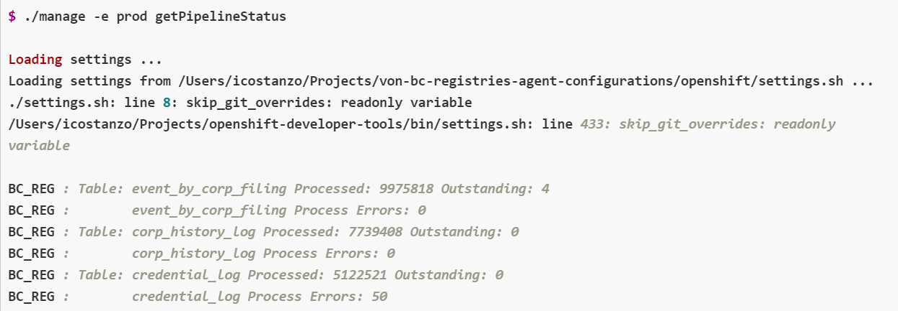

# BC Registries Audit Notification Workflow

The following workflow describes the steps to confirm and resolve a BC Registries Audit alert notification. Additional information regarding the associated error condition and its impact, along with details of the steps to resolve it can be found below.

<p align="center">
  
</p>

## What does an alert look like?



There are three parts (separate messages) associated to each BC Registries Audit Notification, as shown above.  The first provides details on the discrepancies found between the [OrgBook] and the BC Registries data, the second indicates the [Orgbook-configurations `./manage` script] and [BC Registries Agent Configurations `./manage` script] commands you need to run in order to rectify the discrepancies, and the third section provides a summary of the number of each type of discrepancy and a list of the affected corporation records for each type.

In this example there are three discrepancies that need to be fixed:
1) The registration date for BC0111208 is missing from the [OrgBook].
2) The name for BC0441779 is missing a leading `0` in the [OrgBook]
3) The record for BC1383101 is missing from the [OrgBook]

## About the BC Registries Audit Scripts

### What does it take for the BC Registries and [OrgBook] data to pass the audit?

The data must exist in both the BC Registries and [OrgBook] Databases, and the data must match exactly.  To match, the corporation’s name, corporation status, corporation type, business number, registration number, and jurisdiction of the business in both BC Registries and [OrgBook] must all match.

### What is the impact of the data being out of sync?

When the data is out of sync, the data contained in the [OrgBook] is outdated and incorrect.  Citizens, as well as other companies and services use the [OrgBook] as a lookup service and rely on this information to be up to date and accurate.

### What affects the audit results?

Audit results are affected by several factors:

Manual updates to data in BC Registries
- Some updates are made manually and are not associated with event records.  The BC Registry Agent's event processor relies on the event records to detect changes.  Without these records the changes do not get replicated to the [OrgBook] automatically and the discrepancies will not appear until the audit scripts detect them.

Timing
- The BC Registry Agent's event processor runs on a schedule.  So does the audit script.  The schedule for the audit script is offset from that of the event processor to help ensure the event processor has completed a run before the audit scripts are run.  Even with the offset in the schedules, there are times when the audit script will complete while the event processor still has work to do.  In these cases the audit script will report a discrepancy, most commonly a corp missing from the [OrgBook], and by the time you search for the record in the [OrgBook] the discrepancy has already been rectified.

Networking issues and unexpected pod evacuations or restarts
- When these situations occur, it can affect one or more of the components needed to perform the credential processing on either the BC Registries or [OrgBook] side.  These situations typically only cause a temporary discrepancy that will be fixed the next time the BC Registry Agent's event processor runs.


### What steps are needed to resolve reported issues?

Luckily not all discrepancies require user intervention.  When "Wrong business number" issues are detected, they are reported, but the audit scripts also requeue the corporate records automatically providing an automated fix.

For all other reported issues:
1. Confirm the issue(s) by browsing to the [OrgBook].
2. Search for the reported corporation number(s).
3. Review the records to confirm the reported issue(s) with the data still exist.

    Once the issue is confirmed:
    1. Log into the affected OCP environment and run scripts as indicated by the second message in the Audit Notification.  In the case of the example above, you would run the following commands.
        ```
        ./manage -p bc -e prod deleteTopic BC0111208
        ./manage -e prod requeueOrganization 0111208
        ./manage -p bc -e prod deleteTopic BC0441779
        ./manage -e prod requeueOrganization 0441779
        ./manage -e prod queueOrganization 1383101
        ```
        The commands are designed to remove the incorrect data from the [OrgBook] and requeue the data for processing on the BC Registries Agent side.
    2. Run the BC Registries Agent Configurations [`runPipeline`] script to reprocess the data.
    3. Finally search for the corporation number(s) again using [OrgBook]
    4. Verify the reported discrepancies have been fixed.

For more details on this scripts used, refer to the [BC Registries Agent Configurations `./manage` script] and [Orgbook-configurations `./manage` script] sections of this document.

## Digital Trust Monitoring Services OCP Environments

Links to the Deployment Configurations Console can be found here; [Administrator - Deployment Configurations Console](./digital-trust-monitoring-services-environments.md#administrator---deployment-configurations-console)

## BC Registries Agent Configurations `./manage` script

General information regarding the bcgov/von-bc-registries-agent-configurations `./manage` script can be found here; [bcgov/von-bc-registries-agent-configurations `./manage` script](./bc-registries-agent-configurations-manage-script.md)

Specifics regarding the commands referenced in this workflow can be found here:
- [`requeueOrganization`] `command`
- [`queueOrganization`] `command`

## Orgbook-configurations `./manage` script

General information regarding the bcgov/orgbook-configurations `./manage` script can be found here; [bcgov/orgbook-configurations openshift `./manage` script](./orgbook-configurations-manage-script.md)

Specifics regarding the commands referenced in this workflow can be found here:
- [`DeleteTopic`] `command`

## Audit scripts for Aries VCR/OrgBook and BC Registries Issuer

This repository provides scripts to audit the [OrgBook] search database and agent wallet against the source BC Registries data; [Audit Scripts](https://github.com/bcgov/von-bc-registries-audit/blob/main/README.md#understanding-the-output)

## Troubleshoot Failed Credentials Errors

### Credentials not responding to the [`requeueOrganization`] and/or the [`queueOrganization`] commands:

Occasionally credentials get stuck in the processing queue due to errors, and will not respond to the use of the [`requeueOrganization`] and/or [`queueOrganization`] commands.  In these cases you want to check the pipeline status for any errors.

Run the [`getPipelineStatus`] command and check for errors in the `credential_log` table.

For example:


From the output above you can see there are 50 processing errors in the `credential_log` table.  This means there are 50 credentials that have not been processed and posted to the [OrgBook].  To requeue these credentials for processing run the [`requeueFailedCreds`] command.

Once you have verified the credentials have been requeued, run the [`runPipeline`] command to process the outstanding records, and then verify the reported issues have been fixed in the [OrgBook].

### Credentials not responding to the [`requeueOrganization`] command:

In this scenario you've run the [`requeueOrganization`] and [`runPipeline`] as directed, and you've also run [`getPipelineStatus`] to check for errors in the `credential_log` table however the reported issue(s) persist within the [OrgBook].

This happens occasionally when the records in BC Registries are updated manually and key information for an organization is altered. In these limited cases running [`requeueOrganization`] will have no affect as the data contained in the BC Registries Agent does not reflect the changes made on the BC Registries side.  When this occurs [`queueOrganization`] needs to be run to force the data to be reloaded from BC Registries.

Run [`queueOrganization`] followed by [`runPipeline`][`runPipeline`] and then verify the reported issues have been fixed in the [OrgBook].


[OrgBook]: https://orgbook.gov.bc.ca
[`runPipeline`]: ./bc-registries-agent-configurations-manage-script.md#runPipeline-command
[`requeueOrganization`]: ./bc-registries-agent-configurations-manage-script.md#requeueOrganization-command
[`queueOrganization`]: ./bc-registries-agent-configurations-manage-script.md#queueOrganization-command
[`requeueFailedCreds`]: ./bc-registries-agent-configurations-manage-script.md#requeueFailedCreds-command
[`getPipelineStatus`]: ./bc-registries-agent-configurations-manage-script.md#getPipelineStatus-command
[`DeleteTopic`]: ./orgbook-configurations-manage-script.md#DeleteTopic-command
[BC Registries Agent Configurations `./manage` script]: #bc-registries-agent-configurations-manage-script
[Orgbook-configurations `./manage` script]: #orgbook-configurations-manage-script