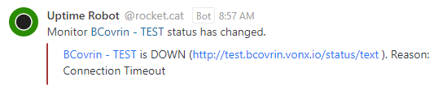

# BCovrin Uptime Alert Workflow

The following workflow describes the steps to confirm and resolve an alert condition on one of the BCovrin Ledger instances.  Additional details can be found below.


## What does an alert look like?




## I don't have SSH access - Who do I notify?

A list of team members who have SSH access to the BCovrin instances will be made available to those assigned to the alert channels.  If in question, you can ask on the alerts channels.

## What causes the alert condition to surface?

The most common cause is described here; [Issue with Ledger Browser (UI) disconnecting from nodes](https://github.com/bcgov/von-network/issues/148).  Less frequently the nodes themselves can crash, which will be detected by the validator node status.  If this happens ledger write consensus can be lost and clients will be unable to write to the ledger.

## Additional troubleshooting steps

### Determine whether all the pods are running

Under normal conditions you should see 4 nodes and a webserver.  Whether or not all pods are running, an error condition can occur due to the fact the Ledger Browser (webserver) can become disconnected from the nodes.  However if a node has crashed and is missing a restart is absolutely required.

For example:
```
<user>@TEST2-von-network:~# docker ps
CONTAINER ID        IMAGE               COMMAND                  CREATED             STATUS              PORTS                              NAMES
aa63be11cb64        von-network-base    "bash -c './scripts/…"   2 months ago        Up 3 days           0.0.0.0:9703-9704->9703-9704/tcp   von_node2_1
ae46dbab16e0        von-network-base    "bash -c './scripts/…"   2 months ago        Up 3 days           0.0.0.0:9707-9708->9707-9708/tcp   von_node4_1
4518a351bc3d        von-network-base    "bash -c 'echo waiti…"   2 months ago        Up 3 days           0.0.0.0:80->8000/tcp               von_webserver_1
25f23fdfea8d        von-network-base    "bash -c './scripts/…"   2 months ago        Up 3 days           0.0.0.0:9701-9702->9701-9702/tcp   von_node1_1
0f0b5cf445ac        von-network-base    "bash -c './scripts/…"   2 months ago        Up 3 days           0.0.0.0:9705-9706->9705-9706/tcp   von_node3_1
```

### Reviewing the logs

If you're interested in attempting to find the cause of the alert condition, you'll want to do this **BEFORE** you use the `./restart-von-network` script as the script truncates the logs which can get very large over time.

For example:
```
<user>@TEST2-von-network:~# cd von-network
<user>@TEST2-von-network:~/von-network# ./manage logs
```

### Shell into a running node to perform diagnostics

For example:
```
docker exec -it von_node2_1 bash
```

Some things you can do while on a node; [von-network - Troubleshooting](https://github.com/bcgov/von-network/blob/master/docs/Troubleshooting.md)

## Instances
The following BCovrin instances are hosted on Digital Ocean.

- http://dev.greenlight.bcovrin.vonx.io/
- http://greenlight.bcovrin.vonx.io/
- http://dev.bcovrin.vonx.io/
- http://test.bcovrin.vonx.io/
- http://prod.bcovrin.vonx.io/