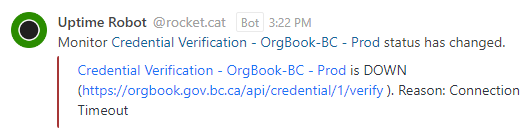

# OrgBook Credential Verification Uptime Alert Workflow

The following workflow describes the steps to confirm and resolve a credential verification alert condition on one of the OrgBook instances.  Addition information regarding the associated error condition and its impact, along with details of the steps to resolve it can be found below.

## What does an alert look like?

## About Credential Verification

Credential verification in the OrgBook involves the API, which exposes the `/credential/{id}/verify` endpoint, the Agent(s) which receive and respond to the resulting proof request, and the Wallet which contains the credentials.  To verify a credential the OrgBook basically sends itself and responses to a proof request.

### What is the impact of credential verification being down?

Credentials can't be verified. More importantly however, this is a clear indication that other agent/wallet operations are affected and inoperable too; operations such as receiving credentials from a registered issuer.

### What affects credential verification?

The most common situation known to affect credential verification is:

Unexpected pod evacuations or restarts
  - When this situation occurs, it can affect one or more of the components needed to perform the credential verification.  Typically, there are enough of the components distributed across unaffected nodes and/or the components start-up on their new compute node fast enough that the issue goes unnoticed.  However, in some cases components can get stuck in a pending or starting state on a node that is overloaded after an unexpected restart or evacuation of another node.
  - These scenarios cause true positive conditions that can require intervention in order to clear the alert in a timely fashion, however in many cases the alert condition is cleared or in the process of clearing automatically by the time you start looking into the issue, in which case you just need to monitor the process to make sure it completes in a timely fashion.

## OrgBook Instances

A list of OrgBook instances can be found here; [OrgBook Instances](./orgbook-instances-and-environments.md#orgbook-instances)

## OrgBook OCP Environments

Links to the Topology Console can be found here; [Developer - Topology Console](./orgbook-instances-and-environments.md#developer---topology-console)

## Recycling a pod or pods

Use the [bcgov/orgbook-configurations openshift `./manage` script](./orgbook-configurations-manage-script.md)'s:
- [`recycle` command](./orgbook-configurations-manage-script.md#recycle)

## Performing a rollout

Information on the various ways to perform a rollout can be found here; [Performing a Rollout](./performing-a-rollout.md)