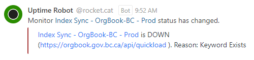

# OrgBook Index Sync Uptime Alert Workflow

The following workflow describes the steps to confirm and resolve an index sync alert condition on one of the OrgBook instances.  Addition information regarding the associated error condition and its impact, along with details of the steps to resolve it can be found below.


## What does an alert look like?



## About OrgBook Indexing

Indexing of credentials received by outside parties such as BC Registries, Liquor and Cannabis Regulation Branch, Ministry of Energy, Mines and Low-carbon Innovation, Ministry of Environment and Climate Change Strategy, and Investment Agriculture Foundation BC, is performed in real-time by the [SolrQueue](https://github.com/bcgov/aries-vcr/blob/master/server/vcr-server/vcr_server/utils/solrqueue.py) class.  This class runs as a threaded process inside OrgBook's (Aries VCR) API.

### What does it mean for indexes to be synchronized?

In short, the indexes are considered synchronized when all records saved to the database have been indexed in `solr`.

### What is the impact of the indexes being out of sync?

Searches and auto-complete in OrgBook rely completely on the `solr` indexes for their results.  When the indexes are not synchronized there are records that exist in the database with no matching index in `solr`.  Those records are essentially hidden from view because they can't be found.

### What affects index synchronization?

There are a few things known to affect indexing and therefore index synchronization:
1. Volume and timing:
    - There can be a slight delay between when credentials are initially received and saved to the database, and when they are indexed (added to the `solr` index).  If a number of records are received simultaneously it can take a bit of time for the indexes to be fully synced.  How long this takes can be influenced by the volume of credentials being received and the duration of time that volume persists.  For example, when an initial data load is being performed the index synchronization process is constantly lagging behind.  In a more steady state scenario the indexing may only lag by a few seconds at a time.
    - These scenarios can cause transient false positive conditions that will clear automatically once the indexing process catches up.
2. Errors in the indexing queue
    - On occasion the indexing queue on an API pod can encounter an error and crash.  Once this occurs and credentials received by this pod will be saved to the database, but they won't be indexed.  This state is characterized by instances of `Error processing real-time index queue` in the API logs. The only way to recover from this is to kill the affected pod and have it replaced.  A rollout is one way to do this; all pods will be replaced.  There are also `RTI_` environment variables that can be set on the API pod that will help automate the process of selectively killing the affected pod when it enters such a condition.
    - These scenarios cause true positive conditions that require the indexes to be synchronized.
3. Unexpected pod evacuations or restarts
    - If a pod has pending indexing work when this occurs the work will be lost, and the indexing won't be completed.
    - These scenarios cause true positive conditions that require the indexes to be synchronized.

## Index synchronization monitoring

The synchronization monitor has been setup to perform a balance between timely detection of true index synchronization issues and detection of false positive conditions.  It checks the state of the indexes every 75 minutes which was selected to minimize the possibility of the monitor running at the same time the BC Registries Agent (which runs every 30 minutes) is performing an update.

## OrgBook Instances
The following OrgBook instances are hosted on OpenShift.

- https://dev.orgbook.gov.bc.ca/
- https://test.orgbook.gov.bc.ca/
- https://orgbook.gov.bc.ca/

## OrgBook OCP Environments
- [`dev`](https://console.apps.silver.devops.gov.bc.ca/k8s/ns/8ad0ea-dev/deploymentconfigs)
- [`test`](https://console.apps.silver.devops.gov.bc.ca/k8s/ns/8ad0ea-test/deploymentconfigs)
- [`prod`](https://console.apps.silver.devops.gov.bc.ca/k8s/ns/8ad0ea-prod/deploymentconfigs)

## The bcgov/orgbook-configurations openshift `./manage` script

The [bcgov/orgbook-configurations](https://github.com/bcgov/orgbook-configurations) repository contains the OCP (OpenShift Container Platform) configurations for the OrgBook instances.  In particular it contains an `openshift` `./manage` script that contains commands for querying and managing the OrgBook environments.  The `./manage` script is built on the [BCDevOps/openshift-developer-tools](https://github.com/BCDevOps/openshift-developer-tools/tree/master/bin) project.  You will need these tools installed before you can use the `./manage` script.  You will also need to be logged into OCP from the command line before using the script.

For details on the commands supported by the script, and details on how to use them, run `./manage -h`.

### `indexSynced` command

This command can be used to determine whether the OrgBook's indexes are fully synced.

For example:
```
Wade@hvWin10x64 MINGW64 /c/orgbook-configurations/openshift (master)
$ ./manage -p bc -e prod indexSynced

Indexes Synced: true
Indexed Credentials: 11869957
Actual Credentials: 11869957 
```

By default the `indexSynced` command queries the `api/quickload` endpoint for the `prod` environment.  To use it on the `dev` or `test` environments you need to specify the `api/quickload` endpoint for the given environment.

For example:
```
Wade@hvWin10x64 MINGW64 /c/orgbook-configurations/openshift (master)
$ ./manage -p bc -e dev indexSynced https://dev.orgbook.gov.bc.ca/api/quickload

Indexes Synced: true
Indexed Credentials: 159962
Actual Credentials: 159962

Wade@hvWin10x64 MINGW64 /c/orgbook-configurations/openshift (master)
$ ./manage -p bc -e test indexSynced https://test.orgbook.gov.bc.ca/api/quickload

Indexes Synced: false - Difference: 20 (99.9998% complete)
Indexed Credentials: 8666419
Actual Credentials: 8666439
```

### `updateSearchIndex` command

This command can be used to sync the OrgBook's indexes stating on a given date when they are out of sync.

For example (some output from the script was removed for clarity):
```
Wade@hvWin10x64 MINGW64 /c/orgbook-configurations/openshift (master)
$ ./manage -p bc -e prod updateSearchIndex -b 500 -d 2021-11-11T00:00:00Z

Updating the search index ...

Indexing 0 addresss
Indexing 69 credentials
Indexing 61 names
Indexing 36 topics
```
- _If you leave off the `Z` at the end of the date/time specification you will see warnings about a `naive datetime`, but you can safely ignore those warnings._

## Performing a rollout

Performing a rollout can be accomplished either in the OCP console or from the command line.

### Performing a rollout - From the console

1. Log into the OCP console and browse to the DeploymentConfigs page of the desired environment.
2. Click on the DeploymentConfig you want to rollout.
3. From the Actions menu select **Start rollout**
4. Monitor the progress in the DeploymentConfig details of the same page.


### Performing a rollout - From the cli

Using the `oc` `cli` start the rollout of the desired `dc` and then monitor the rollout using `status`.

For example:
```
Wade@hvWin10x64 MINGW64 /c/orgbook-configurations/openshift (master)
$ oc -n 8ad0ea-prod rollout latest dc/api-bc
deploymentconfig.apps.openshift.io/api-bc rolled out

Wade@hvWin10x64 MINGW64 /c/orgbook-configurations/openshift (master)
$ oc -n 8ad0ea-prod rollout status dc/api-bc
Waiting for rollout to finish: 0 out of 2 new replicas have been updated...
Waiting for rollout to finish: 1 out of 2 new replicas have been updated...
Waiting for rollout to finish: 1 out of 2 new replicas have been updated...
Waiting for rollout to finish: 1 out of 2 new replicas have been updated...
Waiting for rollout to finish: 1 out of 2 new replicas have been updated...
Waiting for rollout to finish: 1 old replicas are pending termination...
Waiting for rollout to finish: 1 old replicas are pending termination...
Waiting for rollout to finish: 1 old replicas are pending termination...
Waiting for latest deployment config spec to be observed by the controller loop...
replication controller "api-bc-51" successfully rolled out
```


