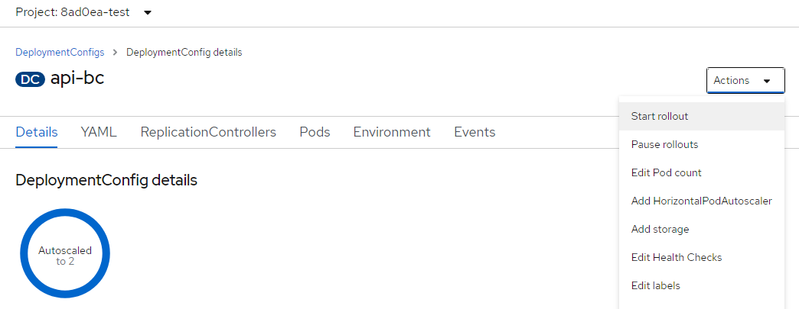

# OrgBook Index Sync Uptime Alert Workflow

The following workflow describes the steps to confirm and resolve an index sync alert condition on one of the OrgBook instances.


## Instances
The following OrgBook instances are hosted on OpenShift.

- https://dev.orgbook.gov.bc.ca/
- https://test.orgbook.gov.bc.ca/
- https://orgbook.gov.bc.ca/

## OCP Environments
- [`dev`](https://console.apps.silver.devops.gov.bc.ca/k8s/ns/8ad0ea-dev/deploymentconfigs)
- [`test`](https://console.apps.silver.devops.gov.bc.ca/k8s/ns/8ad0ea-test/deploymentconfigs)
- [`prod`](https://console.apps.silver.devops.gov.bc.ca/k8s/ns/8ad0ea-prod/deploymentconfigs)

## The bcgov/orgbook-configurations openshift `./manage` script

The [bcgov/orgbook-configurations](https://github.com/bcgov/orgbook-configurations) repository contains the OCP (OpenShift Container Platform) configurations for the OrgBook instances.  In particular it contains an `openshift` `./manage` script that contains commands for querying and managing the OrgBook environments.  The `./manage` is built on the [openshift-developer-tools](https://github.com/BCDevOps/openshift-developer-tools/tree/master/bin) project.  You will need these tools installed before you can use the `./manage` script.  You will also need to be logged into OCP from the command line before using the script.

For details on the commands supported by the script, and details on how to use them, run `./manage -h`.

### `indexSynced` command

This command can be used to determine whether the OrgBook's indexes are fully synced.

For example:
```
Wade@hvWin10x64 MINGW64 /c/orgbook-configurations/openshift (master)
$ ./manage -p bc -e prod indexSynced

Indexes Synced: true
Indexed Credentials: 11869957
Actual Credentials: 11869957 
```

By default the `indexSynced` command queries the `api/quickload` endpoint for the `prod` environment.  To use it on the `dev` or `test` environments you need to specify the `api/quickload` endpoint for the given environment.

For example:
```
Wade@hvWin10x64 MINGW64 /c/orgbook-configurations/openshift (master)
$ ./manage -p bc -e dev indexSynced https://dev.orgbook.gov.bc.ca/api/quickload

Indexes Synced: true
Indexed Credentials: 159962
Actual Credentials: 159962

Wade@hvWin10x64 MINGW64 /c/orgbook-configurations/openshift (master)
$ ./manage -p bc -e test indexSynced https://test.orgbook.gov.bc.ca/api/quickload

Indexes Synced: false - Difference: 20 (99.9998% complete)
Indexed Credentials: 8666419
Actual Credentials: 8666439
```

### `updateSearchIndex` command

This command can be used to sync the OrgBook's indexes when they are out of sync.

For example (some output from the script was removed for clarity):
```
Wade@hvWin10x64 MINGW64 /c/orgbook-configurations/openshift (master)
$ ./manage -p bc -e prod updateSearchIndex -b 500 -d 2021-11-11T00:00:00

Updating the search index ...

Indexing 0 addresss
Indexing 69 credentials
Indexing 61 names
Indexing 36 topics
```
You may see warnings about a `naive datetime`, but you can safely ignore those warnings.

## Performing a rollout

Performing a rollout can be performed either in the OCP console or from the command line.

### Performing a rollout - From the console

1. Log into the OCP console and browse to the DeploymentConfigs page of the desired environment.
2. Click on the DeploymentConfig you want to rollout.
3. From the Actions menu select **Start rollout**
4. Monitor the progress in the DeploymentConfig details of the same page.



### Performing a rollout - From the cli

Using the `oc` `cli` start the rollout of the desired `dc` and then monitor the rollout using `status`.

Example:
```
Wade@hvWin10x64 MINGW64 /c/orgbook-configurations/openshift (master)
$ oc -n 8ad0ea-test rollout latest dc/api-bc
deploymentconfig.apps.openshift.io/api-bc rolled out

Wade@hvWin10x64 MINGW64 /c/orgbook-configurations/openshift (master)
$ oc -n 8ad0ea-test rollout status dc/api-bc
Waiting for rollout to finish: 0 out of 2 new replicas have been updated...
Waiting for rollout to finish: 1 out of 2 new replicas have been updated...
Waiting for rollout to finish: 1 out of 2 new replicas have been updated...
Waiting for rollout to finish: 1 out of 2 new replicas have been updated...
Waiting for rollout to finish: 1 out of 2 new replicas have been updated...
Waiting for rollout to finish: 1 old replicas are pending termination...
Waiting for rollout to finish: 1 old replicas are pending termination...
Waiting for rollout to finish: 1 old replicas are pending termination...
Waiting for latest deployment config spec to be observed by the controller loop...
replication controller "api-bc-51" successfully rolled out
```


