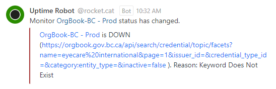

# OrgBook Search Result Uptime Alert Workflow

The following workflow describes the steps to confirm and resolve a search result alert condition on one of the OrgBook instances.  Addition information regarding the associated error condition and its impact, along with details of the steps to resolve it can be found below.

  

## What does an alert look like?

## About Search

The primary purpose of the OrgBook is to be a searchable repository for data associated to verifiable organizations.  The search capabilities of the OrgBook involve the API, which exposes the search APIs, the Search Engine (Solr), and the application database containing the details associated to the companies and the credentials issued to them (the verifiable credentials themselves are stored in the Wallet).

### What is the impact of search being down?

The OrgBook is rendered inoperable.

### What affects search?

The most common situation known to affect search is:

Unexpected pod evacuations or restarts
  - When this situation occurs, it can affect one or more of the components needed to perform the search and retrieval of data.  Typically, there are enough of the components distributed across unaffected nodes and/or the components start-up on their new compute node fast enough that the issue goes unnoticed.  However, in some cases components can get stuck in a pending or starting state on a node that is overloaded after an unexpected restart or evacuation of another node.
  - These scenarios cause true positive conditions that can require intervention in order to clear the alert in a timely fashion, however in many cases the alert condition is cleared or in the process of clearing automatically by the time you start looking into the issue, in which case you just need to monitor the process to make sure it completes in a timely fashion.

## OrgBook Instances

A list of OrgBook instances can be found here; [OrgBook Instances](./orgbook-instances-and-environments.md#orgbook-instances)

## OrgBook OCP Environments

Links to the Topology Console can be found here; [Developer - Topology Console](./orgbook-instances-and-environments.md#developer---topology-console)

## Recycling a pod or pods

Use the [bcgov/orgbook-configurations openshift `./manage` script](./orgbook-configurations-manage-script.md)'s:
- [`recycle` command](./orgbook-configurations-manage-script.md#recycle-command)

## Performing a rollout

Information on the various ways to perform a rollout can be found here; [Performing a Rollout](./performing-a-rollout.md)